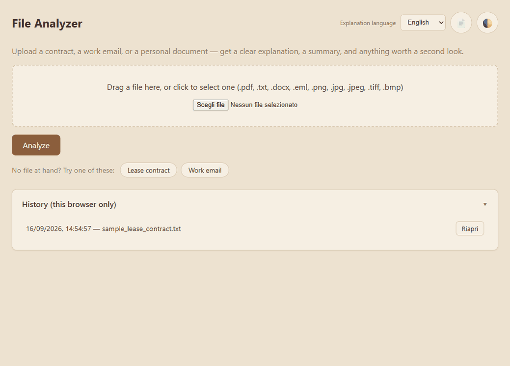
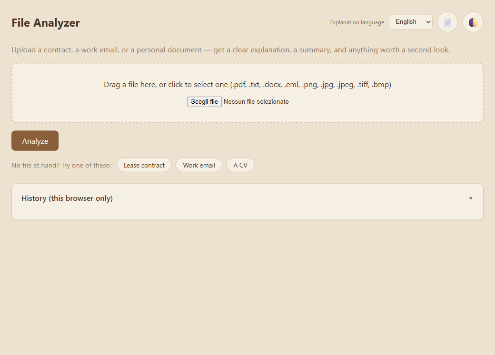
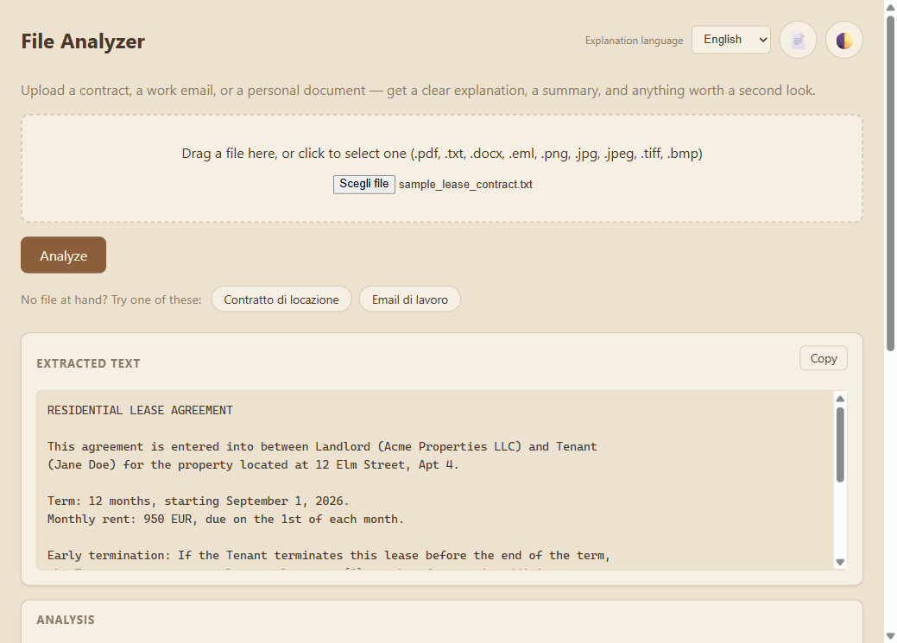
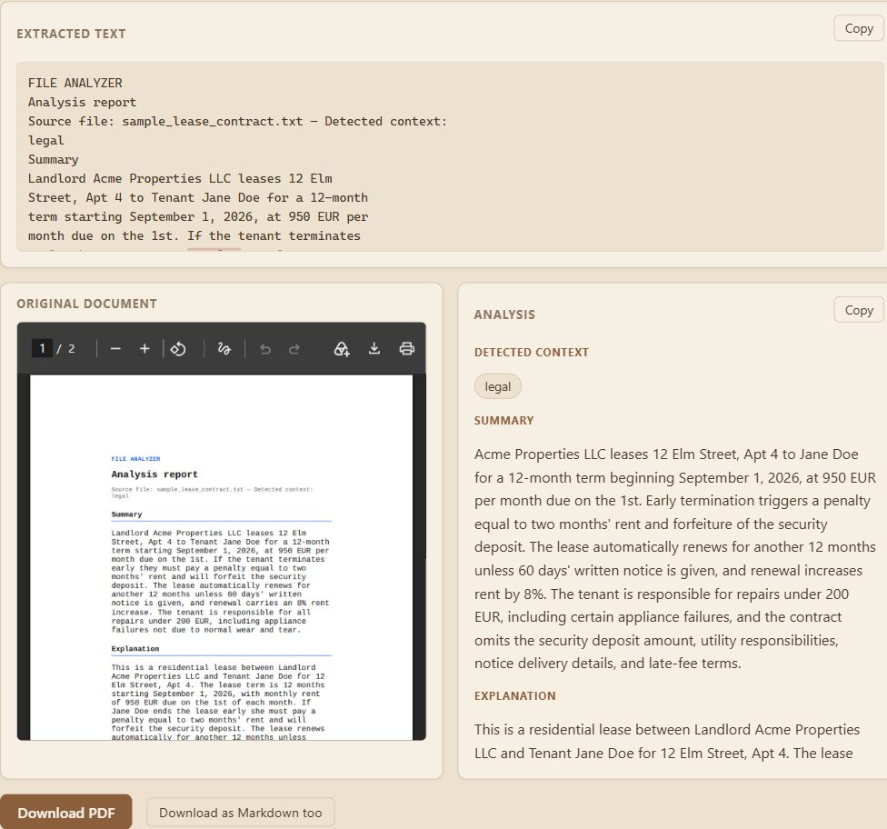
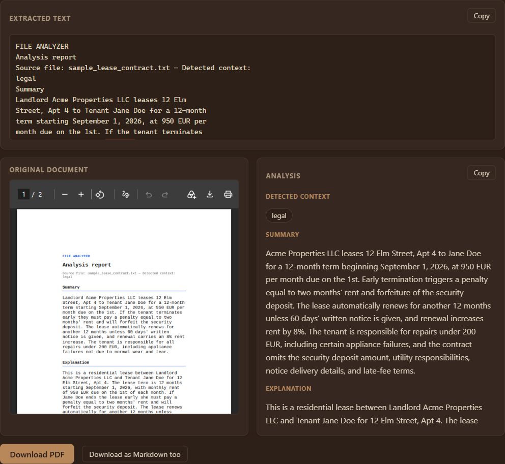

# File Analyzer

Upload a document — a lease, a work memo, a personal letter — and get back a
plain-language explanation, a summary, and a list of things worth paying
attention to, as a downloadable PDF report. No account, no database, nothing
stored: the file exists only for the duration of the request.



## Quick start — one command, no setup

```bash
docker run -d --name file-analyzer -p "${HOST_PORT:-8000}:8000" ghcr.io/lucaalex00/file_analyzer:latest
```

Open http://localhost:8000 (or `http://localhost:$HOST_PORT` if you set
one — the container's own port is always 8000, only the host side is
configurable, in case 8000 is already taken on your machine). No
credentials, no `.env`, no clone needed.

Run this exact command, not Docker Desktop's "Run" button on the image —
the GUI defaults to an auto-generated container name and a random host
port instead of the ones above, which just adds confusion.

To stop it later: `docker stop file-analyzer && docker rm file-analyzer`.

This one container **is the whole app** — extract, analyze, compare,
batch, PDF/Markdown export, the web UI, all of it. There's no separate
image or service per feature to combine: every endpoint in the
[API table below](#api) is just a different route on this same running
container.

With no Azure OpenAI key configured, the app runs in **demo mode**: every
part of the pipeline (extraction, PDF/OCR handling, rule-based red flags,
PDF report generation) is real, only the AI-written explanation/comparison
is simulated and clearly labeled as such, both in the response and in a
banner in the UI. Try it with a file from [`examples/`](examples/), or any
`.pdf`/`.txt`/`.docx`/`.eml`/image of your own.

To run it with a real Azure OpenAI model instead of demo mode:

```bash
git clone https://github.com/Lucaalex00/file_analyzer.git && cd file_analyzer
make env    # creates .env — fill in your Azure OpenAI credentials
make up     # builds and starts the API at http://localhost:8000
```

Or try it from the command line:

```bash
curl -F "file=@examples/sample_lease_contract.txt" http://localhost:8000/analyze -o report.pdf
```

Report PDFs in [`examples/`](examples/) are generated on demand — run
`python scripts/generate_examples.py` with your own Azure OpenAI
credentials (see [`examples/README.md`](examples/README.md)).

## What it does

- Accepts `.pdf`, `.txt`, `.docx`, `.eml` emails, and scanned images (`.png`,
  `.jpg`, `.jpeg`, `.tiff`, `.bmp` — via OCR, no cloud vision service needed)
- Detects whether the document is legal, work-related, or personal
- Explains it in plain language (choose it/en/fr/de/es), summarizes it, and
  flags anything risky or worth a second look — backed by both the LLM and a
  rule-based pre-check (auto-renewal, penalties, tight deadlines, phishing-style
  urgency/credential requests)
- Highlights each flagged passage back in the original text (explainability)
- Returns the analysis as a PDF report, as Markdown, or as structured JSON
- Compares two versions of a document and reports what changed
- Analyzes several files in one batch request
- Nothing is written to disk or a database — everything lives in memory for
  the duration of the request; the browser's local history (if you use the
  web UI) is the only thing that persists, and only in your own browser

## API

| Endpoint | Returns | Notes |
|---|---|---|
| `POST /extract` | `{"text": "..."}` | Extraction only, no LLM call |
| `POST /analyze` | PDF | The stable contract for curl/CLI consumers |
| `POST /analyze/review` | JSON (`analysis` + `pdf_base64`) | Used by the web UI |
| `POST /analyze/markdown` | Markdown file | |
| `POST /analyze/batch` | JSON (`results[]`, one per file) | |
| `POST /compare` | JSON (`comparison`) | Takes `file_a` + `file_b` |

All of the above accept an optional `language` field (`it` default) and are
rate-limited per client IP (`RATE_LIMIT_PER_MINUTE`, default 20/minute).

## CLI

The same pipeline also runs without a server, via `src/cli.py`:

```bash
docker compose run --rm api python -m src.cli extract examples/sample_lease_contract.txt
docker compose run --rm api python -m src.cli analyze examples/sample_lease_contract.txt --format markdown
docker compose run --rm api python -m src.cli compare v1.txt v2.txt
```

`extract` never calls the LLM. `analyze` and `compare` use the same
demo-mode fallback as the API: with no `AZURE_OPENAI_ENDPOINT`/
`AZURE_OPENAI_API_KEY` set (same `.env` as the API), they still run end
to end with a simulated explanation instead of erroring out.

## Architecture

```
Upload → Extractor (pdf/txt/docx/eml/image via OCR) → Analyzer (Azure OpenAI + rule-based) → Report (PDF/Markdown) → Response
```

See [OVERVIEW.md](OVERVIEW.md) for the full technical breakdown, and
[docs/](docs/) for the change log and architecture decisions behind each piece.

## Development

```bash
make test               # pytest
make lint                # ruff
make test-e2e            # Playwright, against the running stack (run `make up` first)
make test-frontend-unit  # Node's built-in test runner, no running stack needed
```

## Screenshots

| | |
|---|---|
|  Upload form, before any file is selected |  Extracted text preview, shown before submitting |
|  Plain-language analysis, with matched red flags highlighted in the source text |  The same view in dark mode |

## Limitations

- **OCR on non-document images** (logos, decorative graphics, stylized
  flyers) is unreliable. Images with no reliably readable text are rejected
  with a clear error rather than analyzed; images with real text in a
  decorative layout may still OCR poorly — there's no fix for this beyond
  what Tesseract itself can do.
- **PDF table reconstruction** only kicks in when pdfplumber detects real
  vector-drawn table lines in the source PDF. Tables built from other
  visual cues (dotted rules, background shading, pure text alignment)
  fall back to whole-page OCR, which reads less cleanly.
- **No persistent server-side storage.** History lives in the browser's
  `localStorage` only — clearing site data or switching browsers loses it.
  There is no server-side record of past analyses.
- **Prompt injection defenses are heuristic, not exhaustive.** The system
  prompt is hardened and a rule-based detector flags common
  injection-style phrases (in English and Italian), but a sufficiently
  novel or obfuscated attempt could still evade detection. Detection is
  a visible red flag, not a hard block — the document is still analyzed.
- **No fallback AI provider.** If Azure OpenAI is unreachable, the
  analyzer retries transient failures a couple of times, then fails the
  whole request — rule-based red flags are not offered as a degraded
  standalone mode.
- **Rate limiting is process-local**, not distributed. It resets per
  process and doesn't coordinate across multiple running instances.
- **Language support is a fixed list** (it/en/fr/de/es) with no
  auto-detection of the source document's language.

## Roadmap

Not yet built: `.msg` (Outlook binary format) email support — `.eml` is
covered — custom PDF branding/themes, and a real Azure Functions deploy
(Bicep already in `infra/`, gated behind a manual, explicitly-approved
step).
